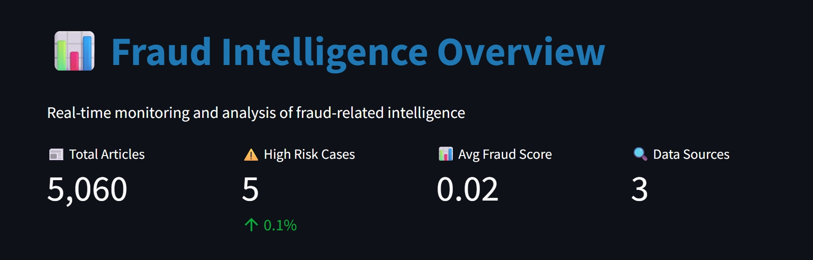
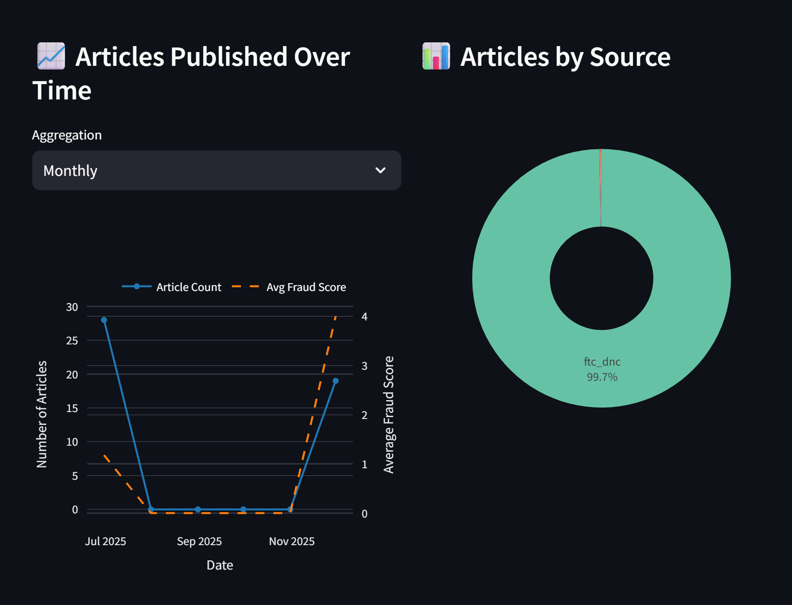
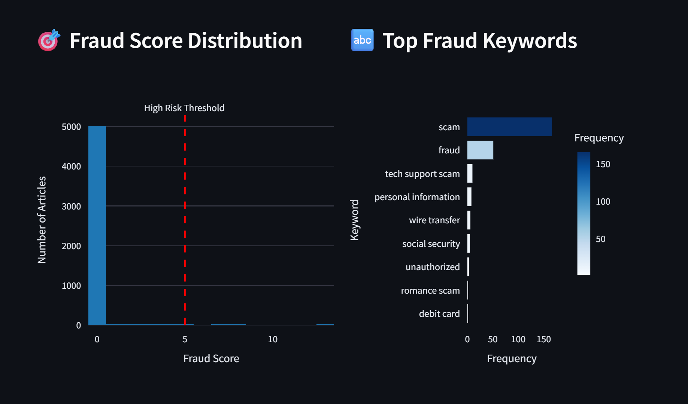
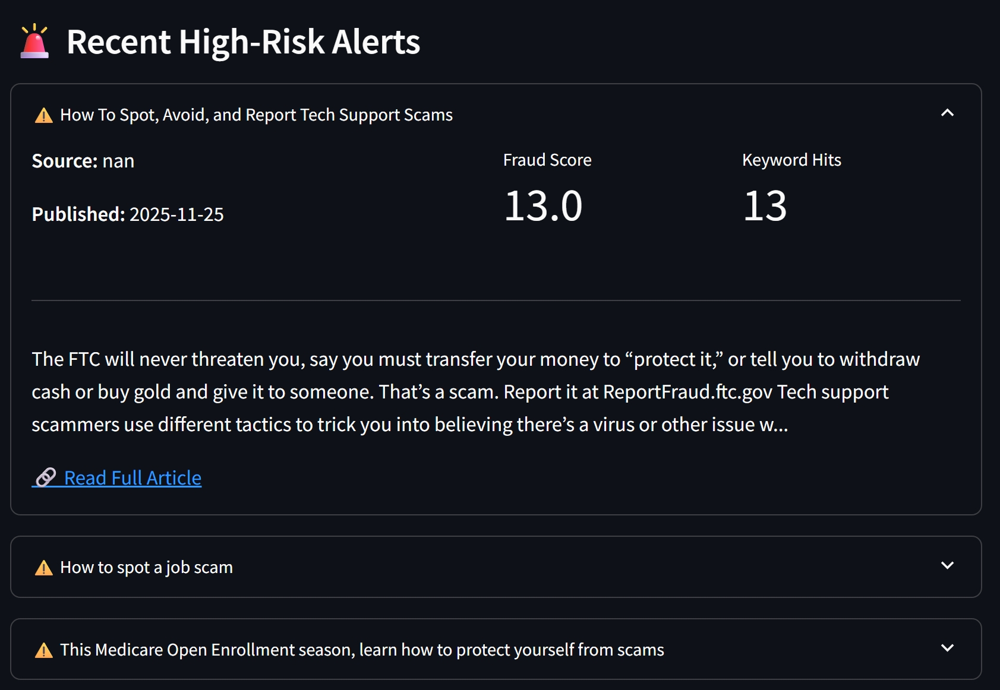

# FTC Fraud Scrapers

**Automated Fraud Intelligence from FTC Data Sources**

**Team Members**

- Daivik Nambiar
- Anisha Nannapaneni
- Lena Ayesh
- Sage Auton

Streamlit dashboard:(https://layesh1--ftc-streamlit-dashboard-run-streamlit.modal.run/)

## Project Summary

A Python-based collection system that web scraps fraud-related content from the Federal Trade Commission (FTC) sources, filters & classifies articles using a fruad detection modal, and loads standardized results into a Supabase database — so that fraud analysts can quickly access a unified, structured dataset without manually searching across multiple FTC sources, enabling faster insights and trend detection.

## Project Structure

)


## Installation & Setup

1. **Create and activate virtual environment:**
```bash
uv sync
.venv\Scripts\activate   
```

2. **Install dependencies:**
```bash
uv sync
```

3. **Configure environment variables:**
Create a `.env` file with your Supabase credentials:
```
SUPABASE_URL=your_supabase_url
SUPABASE_SERVICE_ROLE_KEY=your_service_role_key
```

## Usage

### Quick Start

Use the main entry point for all operations:

```bash
# Run a specific scraper
uv run python main.py scrape press --limit 20 --pages 3
uv run python main.py scrape legal --specific-only
uv run python main.py scrape scams --limit 30

# Load data to Supabase
uv run python main.py load

# Run full pipeline (all scrapers + load to database)
uv run python main.py all

# Show help
uv run python main.py --help
```

### Running Individual Scrapers Directly

You can also run scrapers directly if needed:

```bash
# FTC Press Releases (with pagination)
uv run python src/scrapers/ftc_press_releases.py --limit 20 --pages 3

# FTC Legal Cases
uv run python src/scrapers/ftc_legal_cases.py --limit 20
uv run python src/scrapers/ftc_legal_cases.py --specific-only

# FTC Consumer Scams
uv run python src/scrapers/ftc_consumer_scams.py --limit 30
```

### Using Helper Scripts

Alternative helper scripts are available in `src/scripts/`:

```bash
# Run a specific scraper
uv run python src/scripts/run_scraper.py press --limit 20 --pages 3

# Run all scrapers
uv run python src/scripts/run_all_scrapers.py
```

### Loading Data to Supabase

```bash
# Via main.py (recommended)
uv run python main.py load

# Or directly
uv run python src/database/supabase_load.py
```

The loader will:
- Read all JSONL files from the `data/` directory
- Apply fraud detection scoring
- Deduplicate records by URL
- Filter for fraud-related content (min 2 keyword hits)
- Upsert to the `fraud_articles` table

## How It Works

### 1. Data Collection (Scrapers)

Our pipeline transforms raw FTC web data into structured fraud intelligence:
**Raw Input → Scraping → Classification → Database → Dashboard**

Each scraper returns consistent fields:
- **title**: Article/case title
- **url**: Source URL
- **published**: Publication date
- **body**: Full content text
- **source**: Identifies the data source

Scrapers use keyword filtering ([src/utils/keywords.py](src/utils/keywords.py)) during collection to focus on fraud-related content.

### 2. Fraud Detection

**Tier 1: Content Filtering** ([src/utils/keywords.py](src/utils/keywords.py))
- Basic filtering when scraping
- Simple fraud terms: "fraud", "scam", "phishing", "identity theft" (removes irrelevant articles)
- ≥1 hits minimum required for classification

**Tier 2: Classification** ([src/detect/fraud_detector.py](src/detect/fraud_detector.py))
- Applied during database loading
- Extended 16+ keyword list including: ransomware, money mules, business email compromise, etc.
- ≥2 hits minimum required for classification
- Adds `is_fraud`, `fraud_hits`, and `fraud_score` fields
- Final fraud scoring

### 3. Database Loading

[src/database/supabase_load.py](src/database/supabase_load.py) performs:
- Record normalization across different scraper formats
- Multi-format date parsing
- URL-based deduplication (keeps highest fraud score)
- Batch upserts (500 records per batch)
- Fraud-only filtering

### Visual NLP Pipeline
```
┌─────────────────────┐
│  5,000+ Articles    │  Raw text from database
└──────────┬──────────┘
           │ tokenize + encode
           ▼
┌─────────────────────┐
│ Transformer Model   │  all-MiniLM-L6-v2 (384-dim vectors)
└──────────┬──────────┘
           │ mean pooling + normalize
           ▼
┌─────────────────────┐
│ 384-D Embeddings    │  Semantic representations of articles
└──────────┬──────────┘
           │ PCA / t-SNE
           ▼
┌─────────────────────┐
│ 2D/3D Coordinates   │  Dimensionality reduction for viz
└──────────┬──────────┘
           │ K-Means clustering
           ▼
┌─────────────────────┐
│ Fraud Clusters      │  8 major fraud pattern groups identified
└──────────┬──────────┘
           │ matplotlib
           ▼
┌─────────────────────┐
│ Visual Charts       │  Interactive fraud pattern maps
└─────────────────────┘
```

## 📊 Visuals & Findings

The following visuals come directly from our deployed Streamlit dashboard.  
They demonstrate how our pipeline transforms raw FTC web data into structured,
risk-scored fraud intelligence stored in Supabase.

---

### 📈 Fraud Intelligence Overview



This top-level summary validates that our scraping + classification pipeline is functioning end-to-end:

- **Total Articles (5,060):** Count of all collected FTC articles across press releases, legal cases, and scam alerts.  
- **High-Risk Cases (5):** Articles with unusually high fraud-signal density.  
- **Avg Fraud Score (0.02):** Confirms that while most FTC articles are informational, a small subset contains strong fraud indicators.  
- **Data Sources (3):** Number of FTC sources integrated into the system.

This panel demonstrates that our data pipeline is successfully aggregating and normalizing large-scale FTC content.

---

### 🗓️ Articles Published Over Time



This visualization shows temporal trends in FTC fraud-related content:

- **Article Count Over Time:** Highlights when the FTC publishes more fraud-related material (e.g., seasonal spikes or major scam periods).  
- **Average Fraud Score:** Shows how fraud intensity fluctuates by month.  
- **Articles by Source:** Pie chart breaks down which FTC feeds contribute the most fraud-related articles.

This supports deeper analysis of fraud patterns and allows analysts to detect anomalies or emerging topics.

---

### 🎯 Fraud Score Distribution & Top Keywords



This section explains how our fraud detection model behaves:

- The fraud-score histogram shows that **most articles are low-risk**, while a small number exceed the **high-risk threshold**.  
- The top-keywords chart identifies the most frequently triggered fraud terms, such as *scam*, *fraud*, *tech support scam*, and *wire transfer*.

These visuals demonstrate that our keyword-based scoring model successfully distinguishes high-signal fraud content from routine FTC updates.

---

### 🔔 Recent High-Risk Alerts



This panel shows real examples of articles flagged as **high risk**, such as a tech-support scam warning with **13 keyword hits**:

Each alert includes:
- Title and publication date  
- Fraud score  
- Keyword hit count  
- Article excerpt  
- Link to the full FTC page  

This proves our fraud detection model is able to surface the most critical articles for analyst review, turning raw FTC webpages into meaningful fraud intelligence.


## Why is our project useful?

This project is useful because it consolidates scattered fraud-related content from multiple FTC sources into a single, standardized dataset that analysts can easily search and explore. By automating the scraping, classification, and scoring of articles, the system removes the need for manual research and makes it faster to identify high-risk scams, detect emerging fraud patterns, and monitor trends over time. The dashboard and Supabase integration turn raw web data into actionable fraud intelligence that supports real-time analysis and decision-making.

### Use Cases

1. **Weekly Fraud Monitoring** → Track emerging scam trends and high-risk cases
2. **Quarterly Executive Reports** → Generate data-backed insights for leadership
3. **Case Investigation** → Search and analyze specific fraud types (e.g., "phone support scams")
4. **Trend Analysis** → Visualize fraud patterns over time and by source
5. **Training Data** → Build datasets for machine learning fraud detection models

## Output Format

Scraped data is stored as JSONL (JSON Lines) in the `data/` directory:

```json
{
  "title": "FTC Takes Action Against Scam Operation",
  "url": "https://www.ftc.gov/...",
  "published": "2024-11-02",
  "body": "Full article text...",
  "source": "FTC Press Releases"
}
```

After fraud detection:
```json
{
  "title": "FTC Takes Action Against Scam Operation",
  "url": "https://www.ftc.gov/...",
  "published_at": "2024-11-02T00:00:00",
  "body": "Full article text...",
  "source": "ftc_press",
  "feed": "press",
  "is_fraud": true,
  "fraud_hits": 5,
  "fraud_score": 5.0
}
```

## Development

### Adding a New Scraper

1. Create a new file in `src/scrapers/`
2. Add the path setup at the top:
```python
import sys
from pathlib import Path
sys.path.insert(0, str(Path(__file__).parent.parent.parent))
```
3. Import utilities: `from src.utils import session, save_jsonl, is_fraud`
4. Follow the existing scraper patterns
5. Add to `main.py` SCRAPERS dict

### Testing

Test individual scrapers with small limits:
```bash
# Via main.py
uv run python main.py scrape press --limit 2

# Or directly
uv run python src/scrapers/ftc_press_releases.py --limit 2
```

### Legacy Code 

The `archive/progress_report_1/` directory contains earlier scraper versions that have been superseded by the current implementation.

## Documentation

- [Project Report #1](https://docs.google.com/document/d/1VZiKUrZV7tVySIvheoRG_b6DJoSlaCy5PlLn8rGaA8A/edit?usp=sharing)
- [Project Report #2](https://docs.google.com/document/d/1Im52dJdSkWfOw2B7ZlTYqPvzTsE5ivFe-Obyfu12JPw/edit?usp=sharing)
- [Other Sources](https://docs.google.com/document/d/18-FP38KaaVQip0v_2QEQeRdGYIXpvHbi2aGLMOa0gls/edit?usp=sharing)

## License

This is a student project for USAA fraud detection research.
